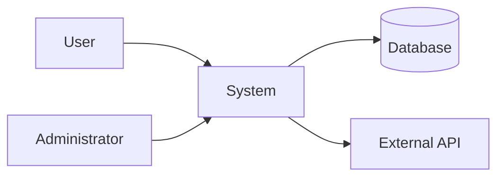

# SRS templates by context

This file contains the full templates with descriptions of each section,
adapted to the project context.

---

## Full ISO/IEC/IEEE 29148 template

This template is the maximal reference. Depending on the tier
(Quick/Standard/Deep), some sections are omitted or merged.

### Section 1: Introduction

#### 1.1 Purpose
The purpose of the SRS document. Which system is being specified.
What problem this system solves.

#### 1.2 Scope
The product scope: what is included AND what is excluded.
Relationship to the organization's business objectives.
Expected benefits, objectives, and goals of the product.

#### 1.3 Intended Audience & Reading Guide
Who reads this document and how. Table:

| Role | Priority sections | Use |
|------|----------------------|-------|
| Product Owner | 1, 2, 3 | Validate functional coverage |
| Developer | 3, 4, 5 | Understand what to build |
| QA / Tester | 3, 4, 7 | Create the test cases |
| Project manager | 1, 2, 7 | Track scope and priorities |
| Client / Stakeholder | 1, 2, executive summary | Approve the features |

#### 1.4 Definitions / Acronyms / Glossary
A table of all technical terms, acronyms, and domain terms.
Adapt the density to the audience: exhaustive for a non-technical client,
targeted for an internal document.

Format:
```
| Term | Definition |
|-------|-----------|
| API | Application Programming Interface — communication interface between systems |
| SRS | Software Requirements Specification — this document |
```

#### 1.5 References
Normative and informative documents referenced:
- Applicable standards (IEEE, ISO, sector regulations)
- Project documents (brief, mockups, architecture)
- Related system specifications

#### 1.6 Document Overview
A description of how the rest of the document is organized.
Conventions used (IDs, priorities, shall notation).

---

### Section 2: Overall Description

#### 2.1 System Perspective
The system's relationship to other systems. Include a **context diagram**
(mermaid) showing the system and its external interactions.



Types of perspectives:
- **System within a larger system** — describe the interfaces
- **Replacement of an existing system** — describe the differences
- **New standalone system** — describe the operational context

#### 2.2 System Functions
The system's major functions, a high-level functional decomposition.
No individual requirement detail here — overview only.
May use a functional decomposition diagram.

#### 2.3 User Classes & Characteristics
Each type of user with:
- Role name
- Frequency of use
- Technical level
- Features used
- Privileges / permissions

#### 2.4 Operating Environment
- Target hardware (servers, devices, browsers)
- Supported OS / platforms
- Network environment
- Runtime dependencies (Node.js, Python, JVM, etc.)

#### 2.5 Design & Implementation Constraints
Imposed constraints that limit the design choices:
- Imposed technical stack
- Code standards
- Regulations
- Budget / infra constraints
- Legacy compatibility

#### 2.6 Assumptions & Dependencies
- **Assumptions**: hypotheses held to be true (e.g. "users have a modern
  browser")
- **Dependencies**: external factors the project depends on (e.g. "the
  partner API will be available in v2 before launch")

---

### Section 3: Functional Requirements

Organized by **feature** or by **use case**. Each requirement follows this
format:

```markdown
#### FR-001: [Requirement name]

**Statement**: The system shall [specific action].

**Priority**: Must Have

**Description**: [Context and details if needed]

**Acceptance Criteria**:
- [ ] [Measurable criterion 1]
- [ ] [Measurable criterion 2]

**Source**: [Client brief / Stakeholder X / Technical constraint]

**Dependencies**: [FR-XXX if there is a dependency]
```

For non-technical audiences, use the User Story format:

```markdown
#### FR-001: [Name]

**As a** [role], **I want** [feature],
**so that** [benefit].

**Priority**: Must Have

**Acceptance criteria**:
- Given [context], When [action], Then [result]
```

---

### Section 4: Non-Functional Requirements

#### 4.1 Performance

| ID | Requirement | Metric | Threshold | Measurement method |
|----|------------|---------|-------|-------------------|
| NFR-P01 | API response time | p95 latency | < 200ms | Load test (k6/Artillery) |
| NFR-P02 | Throughput | Requests/sec | > 1000 rps | Load test |
| NFR-P03 | Page load time | First Contentful Paint | < 1.5s | Lighthouse |

#### 4.2 Security

| ID | Requirement | Standard | Acceptance |
|----|------------|---------|------------|
| NFR-S01 | Authentication | OAuth2 / OIDC | All endpoints protected |
| NFR-S02 | Encryption in transit | TLS 1.3 | SSL Labs A+ score |
| NFR-S03 | Encryption at rest | AES-256 | Sensitive data encrypted |

#### 4.3 Reliability & Availability

| ID | Requirement | SLA | Recovery |
|----|------------|-----|----------|
| NFR-R01 | Uptime | 99.9% | Auto-recovery < 5min |
| NFR-R02 | RPO | 1 hour | Incremental backup |
| NFR-R03 | RTO | 4 hours | Documented runbook |

#### 4.4 Usability
Include: accessibility (WCAG level), i18n/l10n support, responsive design.

#### 4.5 Maintainability
Include: code standards, test coverage, documentation, observability.

#### 4.6 Portability & Compatibility
Include: supported platforms, browsers, versions, migration.

---

### Section 5: External Interface Requirements

#### 5.1 User Interfaces
- Design principles and UI guidelines
- Main layouts (wireframes or mockup refs)
- Accessibility standards

#### 5.2 Hardware Interfaces
- Sensors, specialized devices
- Physical constraints
- (N/A for pure web applications — state it)

#### 5.3 Software Interfaces
- APIs consumed and exposed
- Protocols and formats (REST, GraphQL, gRPC, WebSocket)
- Required libraries / SDKs
- Data exchange format (JSON, Protobuf, etc.)

#### 5.4 Communications Interfaces
- Network protocols (HTTP/2, AMQP, MQTT)
- Required bandwidth
- Encryption of communications

---

### Section 6: Other Requirements

#### 6.1 Legal / Regulatory / Compliance
- GDPR, HIPAA, PCI-DSS depending on the domain
- Software licenses
- Contractual obligations

#### 6.2 Data Requirements
- Conceptual data model
- Retention policy
- Archiving and purging

#### 6.3 Internationalization / Localization
- Supported languages
- Formats (dates, currencies, units)
- Text direction (LTR/RTL)

---

### Section 7: Verification & Validation

#### 7.1 Verification Methods

| Method | Use |
|---------|-------|
| **Test** | Execution with an observable result (unit, integration, E2E) |
| **Inspection** | Manual review of the code/document |
| **Demonstration** | Show the behavior (stakeholder demo) |
| **Analysis** | Proof by reasoning (theoretical performance) |

#### 7.2 Traceability Matrix (Deep tier only)

| Req. ID | Source | Design Ref | Test Case | Status |
|---------|--------|-----------|-----------|--------|
| FR-001 | Brief §2.1 | ARCH-001 | TC-001 | Draft |

#### 7.3 Acceptance Criteria
Global acceptance conditions for the system.

---

### Section 8: Appendices

- Extended glossary
- Detailed diagrams
- Full usage scenarios
- TBD list (items to resolve with target date and owner)
- Document revision history

---

## Adaptation by tier

### Quick tier (MVP / POC)
Mandatory sections: 1.1, 1.2, 2.1, 2.2, 3 (simplified), 4 (summary)
Format: a single document, no deep subsections.

### Standard tier (client project)
Mandatory sections: 1 through 7 complete
Optional sections: 7.2 (traceability matrix), 8 (appendices)

### Deep tier (regulated / enterprise)
All sections mandatory + traceability matrix + FMEA + appendices
